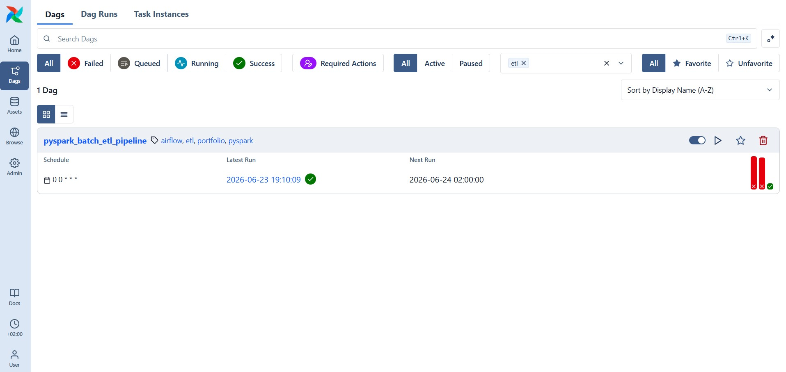
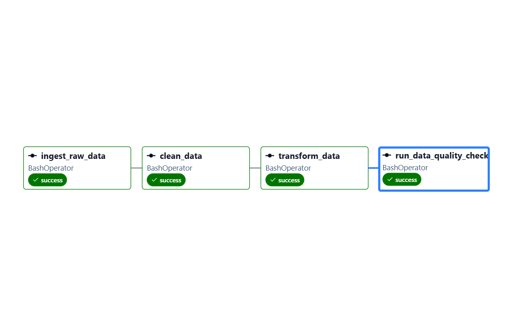
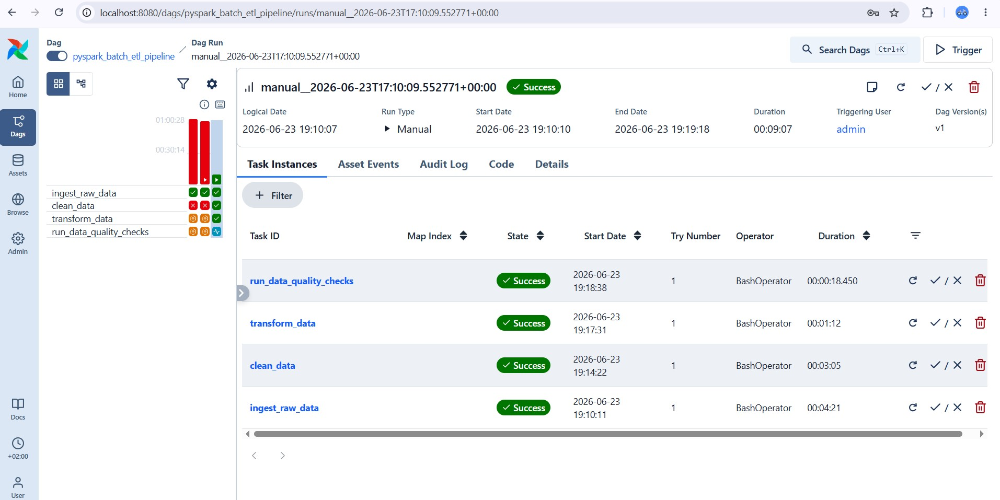
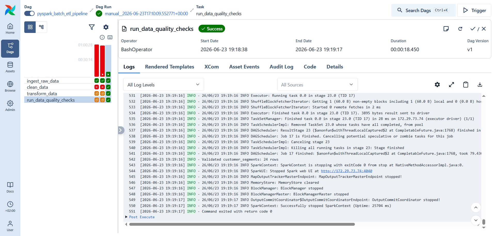

# End-to-End Batch Data Pipeline with PySpark, Airflow, Docker, and PostgreSQL

## 1. Project Overview

This project builds a local batch data pipeline for NYC Yellow Taxi analytics.
It ingests raw taxi trip data, cleans and validates the records with PySpark,
creates analytics-ready tables, orchestrates the workflow with Apache Airflow,
and loads selected outputs into PostgreSQL for SQL-based validation.

The project is intentionally learning-focused but production-shaped: business
logic is separated from file I/O, runtime settings come from environment
variables, transformations are tested, Airflow owns task order, and PostgreSQL
acts as a queryable serving layer.

## 2. Architecture Diagram

```text
NYC taxi Parquet + taxi zone CSV
              |
              v
        Airflow DAG
              |
              v
  PySpark ingest -> clean -> transform
              |
              v
  Partitioned Parquet analytics tables
              |
              v
     PySpark data quality checks
              |
              v
  CSV exports for selected analytics tables
              |
              v
   Dockerized PostgreSQL analytics schema
              |
              v
        SQL validation queries
```

## 3. Tech Stack

- Python
- PySpark
- Spark SQL
- Apache Airflow
- Docker Compose
- PostgreSQL
- pandas
- SQLAlchemy
- pytest
- Ruff

## 4. Dataset

The taxi pipeline expects two files under `data/raw/`:

- `yellow_tripdata_2024-01.parquet` - January 2024 NYC Yellow Taxi trips.
- `taxi_zone_lookup.csv` - taxi location IDs, boroughs, zones, and service zones.

The zone lookup CSV is committed because it is small. The taxi trip Parquet file
is intentionally ignored by Git and must be downloaded once:

```bash
curl -L --fail --create-dirs \
  -o data/raw/yellow_tripdata_2024-01.parquet \
  https://d37ci6vzurychx.cloudfront.net/trip-data/yellow_tripdata_2024-01.parquet
```

The small `orders.csv` and `customers.csv` files are only for the optional
PySpark basics exercise in `examples/`.

## 5. Pipeline Steps

The local pipeline has five steps:

```text
ingest -> clean -> transform -> validate -> load_to_postgres
```

`ingest` reads the source Parquet and zone CSV, verifies required columns, and
writes stable raw Parquet copies under `data/processed/raw/`.

`clean` standardizes types and column names, removes duplicates, fills missing
passenger counts, filters invalid records, derives date columns, and writes clean
partitioned Parquet under `data/processed/clean/`.

`transform` joins trips to pickup and drop-off zones, translates payment codes,
and creates six analytics tables under `data/processed/analytics/`:

| Table | Grain | Purpose |
| --- | --- | --- |
| `daily_revenue` | one row per pickup date | Daily trip volume and revenue |
| `pickup_zone_summary` | one row per pickup borough and zone | Highest-value pickup areas |
| `payment_method_summary` | one row per payment method | Payment behavior comparison |
| `distance_band_summary` | one row per distance band | Distance, revenue, and duration patterns |
| `monthly_summary` | one row per month | Overall reporting-month performance |
| `borough_trip_summary` | one row per borough and distance band | Trip patterns by borough |

`validate` reads the persisted Parquet outputs and enforces data contracts.

`load_to_postgres` reads selected Spark CSV exports and loads them into
PostgreSQL.

## 6. Airflow DAG

The Airflow DAG is defined in `dags/taxi_etl_dag.py`. It uses `BashOperator`
tasks so Airflow controls orchestration while PySpark and Python modules perform
the actual data work.

Task order:

```text
ingest_raw_data
  -> clean_data
  -> transform_data
  -> run_data_quality_checks
  -> load_to_postgres
```

The DAG is manually triggered because the source data is a fixed monthly
snapshot. It includes task dependencies, retries, logs, and a final PostgreSQL
loading task.

## 7. Docker Setup

Week 3 Dockerizes PostgreSQL first. PySpark and Airflow still run from the local
project virtual environment, which keeps the learning path simple and avoids
breaking the working Week 2 pipeline.

Start PostgreSQL:

```bash
docker compose up -d
docker ps
```

The `docker-compose.yml` file starts a `postgres:16` container named
`etl_postgres`, exposes port `5432`, stores database files in a Docker volume,
and runs `sql/create_tables.sql` on first startup.

Check the database:

```bash
docker exec -it etl_postgres psql -U etl_user -d etl_db
```

Inside `psql`:

```sql
SELECT current_database();
\dt analytics.*
\q
```

If `sql/create_tables.sql` changes after the database volume already exists,
reset the local volume:

```bash
docker compose down -v
docker compose up -d
```

## 8. PostgreSQL Analytics Tables

The PostgreSQL serving layer uses the `analytics` schema:

```text
analytics.daily_revenue
analytics.pickup_zone_summary
analytics.payment_method_summary
```

These tables are created by `sql/create_tables.sql`. The loader in
`src/taxi_etl/postgres.py` truncates each target table and appends the latest
CSV export from `data/processed/postgres_exports/`.

Expected row counts for the default January 2024 run:

```text
analytics.daily_revenue: 31 rows
analytics.pickup_zone_summary: 257 rows
analytics.payment_method_summary: 5 rows
```

## 9. Data Quality Checks

Data quality is enforced before PostgreSQL loading. Each analytics table must:

- contain all required columns;
- contain at least one row;
- have non-null business keys;
- have unique business keys;
- have non-negative trip counts and revenue metrics.

The contracts live in `src/taxi_etl/quality.py`. A failed contract raises an
exception, which marks the local run or Airflow task as failed.

SQL validation after loading is stored in `sql/validation_queries.sql`. It checks
row counts and returns sample analytics records from PostgreSQL.

## 10. How To Run

Create and install the local environment:

```bash
python3 -m venv .venv
source .venv/bin/activate
python -m pip install --upgrade pip
python -m pip install -r requirements.txt
python -m pip install -r requirements-dev.txt
python -m pip install -r requirements-airflow.txt
```

Download the taxi data:

```bash
curl -L --fail --create-dirs \
  -o data/raw/yellow_tripdata_2024-01.parquet \
  https://d37ci6vzurychx.cloudfront.net/trip-data/yellow_tripdata_2024-01.parquet
```

Start PostgreSQL:

```bash
docker compose up -d
```

Run the PySpark pipeline manually:

```bash
python run_pipeline.py
```

Load PostgreSQL manually:

```bash
python -m taxi_etl.postgres
```

Run SQL validation:

```bash
docker exec -i etl_postgres psql -U etl_user -d etl_db < sql/validation_queries.sql
```

Run the full Airflow DAG locally without starting the scheduler:

```bash
AIRFLOW_HOME=/home/saad_abdullah/projects/pyspark-airflow-etl-project/.airflow \
AIRFLOW__CORE__DAGS_FOLDER=/home/saad_abdullah/projects/pyspark-airflow-etl-project/dags \
AIRFLOW__CORE__LOAD_EXAMPLES=False \
airflow dags test pyspark_batch_etl_pipeline 2024-01-03
```

Run tests and lint:

```bash
python -m ruff check .
python -m pytest -q
```

## 11. Screenshots

Existing Airflow evidence:









Recommended Week 3 screenshots to add from your terminal or UI:

- Docker container running: `docker ps`
- PostgreSQL tables: `\dt analytics.*`
- SQL validation output: `docker exec -i etl_postgres psql -U etl_user -d etl_db < sql/validation_queries.sql`
- Project folder structure from VS Code or GitHub

Current Week 3 verification output:

```text
NAMES          IMAGE         STATUS                    PORTS
etl_postgres   postgres:16   Up healthy                0.0.0.0:5432->5432/tcp

analytics.daily_revenue: 31 rows
analytics.pickup_zone_summary: 257 rows
analytics.payment_method_summary: 5 rows
```

## 12. Future Improvements

- Add screenshots for Docker, PostgreSQL tables, SQL validation, and project
  structure.
- Add a separate `validate_postgres_tables` Airflow task.
- Add a pipeline `Dockerfile` after the PostgreSQL-only Docker setup feels clear.
- Add dbt models on top of PostgreSQL for Week 4.
- Add GitHub Actions for linting and tests.
- Add cloud storage such as S3 for a more realistic data lake layer.

## Project Structure

```text
.
|-- dags/
|   `-- taxi_etl_dag.py
|-- data/
|   |-- raw/
|   `-- processed/
|-- docs/
|   |-- architecture.md
|   |-- learning-guide.md
|   `-- screenshots/
|-- examples/
|   `-- pyspark_basics.py
|-- sql/
|   |-- create_tables.sql
|   `-- validation_queries.sql
|-- src/taxi_etl/
|   |-- cli.py
|   |-- config.py
|   |-- pipeline.py
|   |-- postgres.py
|   |-- quality.py
|   |-- schemas.py
|   |-- spark.py
|   `-- transformations.py
|-- tests/
|-- docker-compose.yml
|-- pyproject.toml
|-- README.md
|-- requirements-airflow.txt
|-- requirements-dev.txt
|-- requirements.txt
`-- run_pipeline.py
```

## Configuration

Defaults are suitable for local development and can be overridden without editing
code.

| Environment variable | Default | Purpose |
| --- | --- | --- |
| `TAXI_DATA_YEAR` | `2024` | Source filename and reporting year |
| `TAXI_DATA_MONTH` | `1` | Source filename and reporting month |
| `SPARK_MASTER` | `local[2]` | Spark execution master |
| `SPARK_DRIVER_MEMORY` | `2g` | Local driver memory |
| `SPARK_SQL_SHUFFLE_PARTITIONS` | `4` | Local shuffle partitions |
| `SPARK_LOG_LEVEL` | `WARN` | Spark log verbosity |
| `SPARK_TIME_ZONE` | `America/New_York` | Timestamp interpretation |
| `POSTGRES_USER` | `etl_user` | PostgreSQL user |
| `POSTGRES_PASSWORD` | `etl_password` | PostgreSQL password |
| `POSTGRES_HOST` | `localhost` | PostgreSQL host |
| `POSTGRES_PORT` | `5432` | PostgreSQL port |
| `POSTGRES_DB` | `etl_db` | PostgreSQL database |

## Troubleshooting

### Missing Raw Data

Download the taxi Parquet file and confirm the path matches the configured year
and month:

```text
data/raw/yellow_tripdata_2024-01.parquet
```

### PostgreSQL Loader Cannot Connect

Confirm the container is healthy:

```bash
docker ps
```

If another local PostgreSQL service already uses port `5432`, stop that service
or change the published port in `docker-compose.yml` and set `POSTGRES_PORT` to
match.

### Airflow Cannot Find Python

The DAG defaults to `.venv/bin/python`. Set `TAXI_ETL_PYTHON_BIN` if Airflow
should use a different Python executable.

### WSL Spark Runs Out Of Memory

Local Spark runs are more reliable when WSL has enough memory assigned. If Spark
workers exit unexpectedly, increase the WSL 2 memory limit in your Windows user
`.wslconfig`, then restart WSL.
